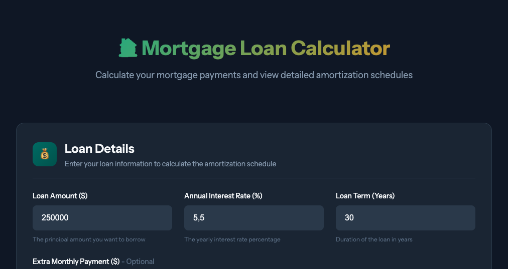
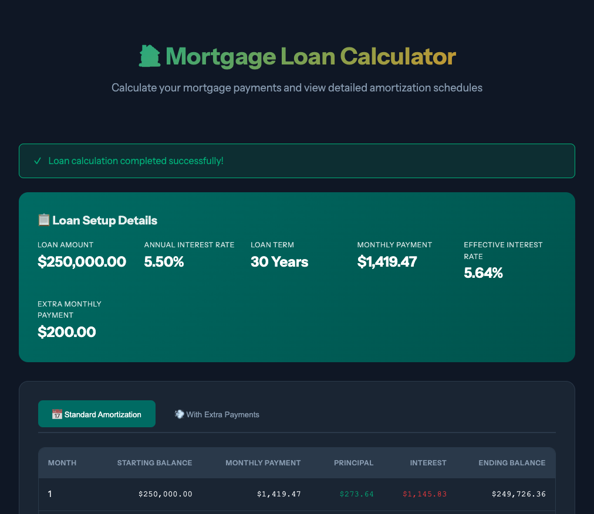
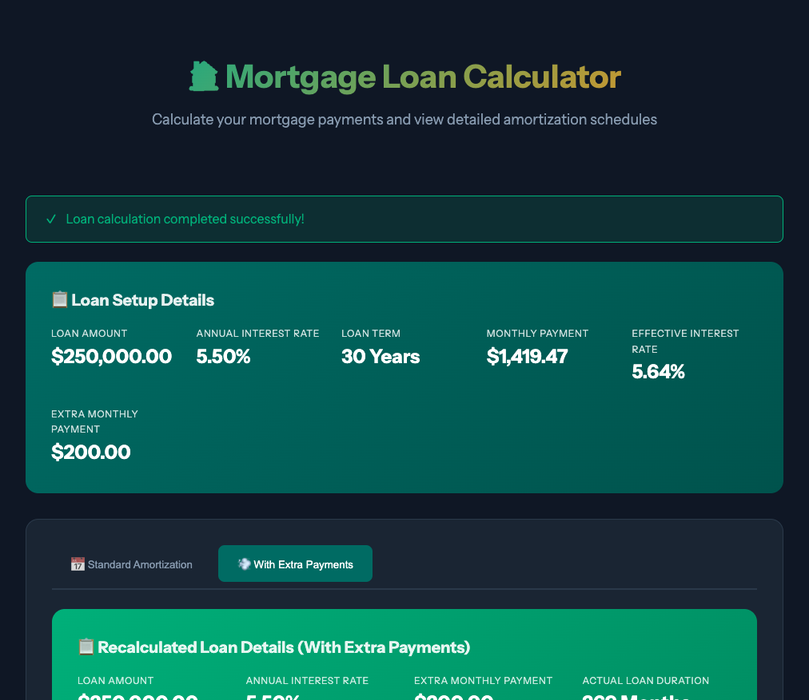

# Mortgage Loan Calculator

A Laravel-based mortgage loan calculator web application that generates amortization schedules with support for extra repayments.

## Screenshots

### Loan Calculator Form


### Loan Schedule with Header (Requirement #7)


### Extra Repayment Schedule


## Prerequisites

- Docker Desktop installed and running
- Git

## Quick Start

### 1. Clone the Repository

```bash
git clone <repository-url>
cd Backend-Exam
```

### 2. Start Docker Desktop

Make sure Docker Desktop is running on your machine.

### 3. Build and Start Containers

```bash
docker compose up -d --build
```

### 4. Install Dependencies

```bash
docker compose exec laravel.test composer install
```

### 5. Generate Application Key

```bash
docker compose exec laravel.test php artisan key:generate
```

### 6. Run Database Migrations

```bash
docker compose exec laravel.test php artisan migrate
```

### 7. Access the Application

| Service | URL | Description |
|---------|-----|-------------|
| Laravel App | http://localhost | Main application |
| phpMyAdmin | http://localhost:8080 | Database management |

## API Endpoints

| Method | Endpoint | Description |
|--------|----------|-------------|
| POST | `/api/v1/loans/calculate` | Calculate loan and generate schedules |
| GET | `/api/v1/loans` | List all loans |
| GET | `/api/v1/loans/{id}` | Get specific loan |
| DELETE | `/api/v1/loans/{id}` | Delete a loan |
| GET | `/api/v1/loans/{id}/amortization-schedule` | Get amortization schedule |
| GET | `/api/v1/loans/{id}/extra-repayment-schedule` | Get extra repayment schedule |

## Running Tests

```bash
docker compose exec laravel.test php artisan test
```

